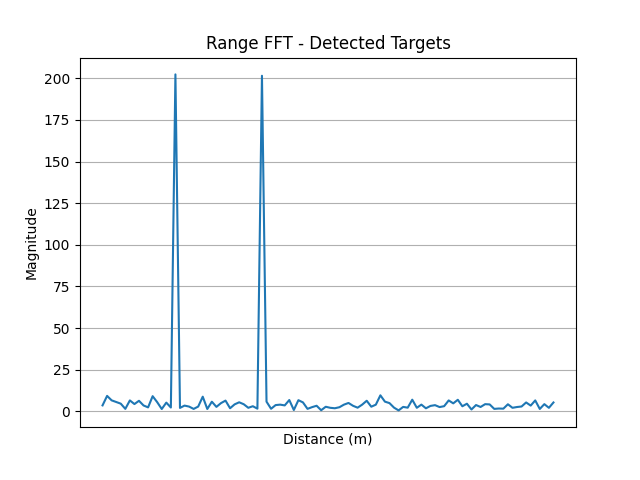

## Task 2-1: Apply FFT (10 points)

**You are required to implement the functions in `task_2_1.py`**.

Compute the frequency spectrum of the following signals. You are supposed to implement `apply_fft_pt()` for the following signal.

The sampling rate `self.fs` is 2000 Hz. The time range is $-1 \le t < 1s$. In this task, you are required to return the frequency spectrum, i.e. frequency axis and magnitude. Also, you are expected to perform $N$-point FFT, where $N$ is the length of the signal.

The signal is defined as follows:
$$
s(t) = 2.025 \cdot \cos(2 \pi \cdot 20.25 \cdot t + \pi/3)
$$

You should return the frequency axis and magnitude of the signal.

> Run `python check.py --task 1` to evaluate your implementation. Note that passing the test does not guarantee full points. The final grading will be based on the correctness of your implementation.


## Task 2-2: Get Frequency from FFT I (30 points)

**You are required to implement the functions in `task_2_2.py`**.

In this task, you are now given multiple files. These files contain signals that we want you to perform frequency analysis on. Your task is to implement `get_freq_spt()`, `get_bw_chirp()`, `get_heart_rate()` and `get_breathe_rate()`, respectively.

1. `task_2_2_1.pickle`: The sum of several pure tone signals. The sampling rate is 16000 Hz. You need to return 3 primary frequency components in descending order.
   
2. `task_2_2_2.pickle`: A chirp signal. The sampling rate is 16000 Hz. In this task, your task is to return the bandwidth of the chirp signal.
   
3. `task_2_2_3.pickle`: A clip of ECG (electrocardiogram) signal. The sampling rate is 100 Hz. Your task is to uncover the heart rate from ECG. Heartbeat is a periodic event, and the heart rate is the frequency that the heart beats.  The heart rate of this participant is between 60 - 90 BPM (Beat Per Second). You should return the heart rate in BPM. 


  

**Note:**

- For task 2_2_3, you are recommended to only focus on those peaks whose corresponding frequencies lie in the reasonable range of your task, i.e. heart rate range or breathing rate range.
- For tasks 2_2_2 and 2_2_3, your results will be evaluated within certain thresholds to determine their accuracy. We will use two thresholds to assess your answers: one for correct answers and another for incorrect ones. Answers falling between these thresholds will have their grades adjusted proportionally based on their proximity to the Ground Truth (GT).
  - task 2_2_2: A response within $\pm 10\%$ of the GT will be considered correct. Answers deviating by more than $\pm 15\%$ from the GT will be marked incorrect.
  - task 2_2_3: The floating ratio is $\pm 5\%$ for a correct answer and $\pm 8\%$ for an incorrect one.

> Run `python check.py --task 2` to evaluate your implementation. Note that passing the test does not guarantee full points. The final grading will be based on the correctness of your implementation.


## Task 2-3: Get Frequency from FFT II (20 points)

**You are required to implement the functions in `task_2_3.py`**.

Get the frequency list of the following signals. The time range is $\left.\left[-\dfrac{N}{2\cdot f_s}, -\dfrac{N}{2\cdot f_s}\right.\right)$s, where $f_s$ is the sampling rate and $N$ is the number of samples. We perform $N$-point FFT. 

In this task, you have to first set proper `fs` and `N`, then perform FFT and get the frequency list.

> Hint: The answer is not uniquely determined. You can consider the frequency reolution and the Nyquist frequency.

> **2-3-1**: Implement `get_freq_1()` to get the frequency list of signal function:

$$
s(t) = \cos(2 \pi \cdot 50.99 \cdot t) + \cos(2 \pi \cdot 51 \cdot t) + \sin(2 \pi \cdot 51.02 \cdot t)
$$

> **2-3-2**: Implement `get_freq_2()` to get the frequency list of signal function:

$$
s(t) = \cos(2 \pi \cdot 51.2 \cdot t) + \sin(2 \pi \cdot 1000.6 \cdot t) + \cos(2 \pi \cdot 2000 \cdot t)
$$

You have to return `fs`, `N`, and `f`, where `f` is the frequency list.

## Task 2-4: FMCW Radar (40 points)

**You are required to implement the functions in `task_2_4.py`**.

In this task, you will gain experience with a mmWave radar system. 

Usually, a typical mmWave radar employs a frequency-modulated continuous-wave (FMCW, a.k.a chirp) signal to detect the target. The radar system transmits a continuous wave signal with a frequency that linearly increases over time. The radar system then receives the reflected signal from the target. By comparing the transmitted and received signals, the radar system can determine the distance and angle of the target.

We define the FMCW signal as follows:
$$
s(t) = \exp\left(j \cdot 2\pi \cdot (f_s \cdot + \dfrac{B}{2 \cdot T} \cdot t)\cdot t\right)
$$
where $f_s$ is the starting frequency,  and $\phi$ is the phase offset. We omit the amplitude item here. $B$ is the bandwidth of the chirp signal, and $T$ is the duration of the chirp signal. These parameters are set as follows:
```python
# Radar parameters
c = 3e8           # Speed of light (m/s)
fc = 1e9          # Carrier frequency (Hz) 
B = 1.5e9         # Bandwidth (Hz)
T = 100e-6        # Chirp duration (s)
Fs = 2e6          # Sampling rate (Hz)
NUM_ANTENNAS = 4  # Number of antennas
```


> **Checkpoint 1:** Generate the transmitted signal (5 points).

You are required to implement `generate_transmitted_signal()` to generate the transmitted signal. You should return the transmitted signal. Please note that you should return the chirp signal in the complex form.

The transmitted signal will then transverse and be reflected off the object. We then multiply the received signal with the transmitted signal to get the IF signal, which is given by

$$
s_{\text{IF}}(t) = s(t) \cdot r^*(t)
$$
where $r(t)$ is the received signal. `*` denotes the complex conjugate.

> **Checkpoint 2:** Compute the IF signal (5 points).

You are required to implement `compute_if_signal()` to generate the IF signal. You should return the IF signal and the time axis.

Then we will estimate the distance of the target by analyzing the IF signal. As discussed in the lecture, the temporal difference is tiny and can hardly be observed directly. Alternatively, we can analyze the frequency difference between the transmitted and received signals. The relationship between the frequency difference and the distance is given by
$$
d = \frac{c \cdot f_d \cdot T}{2 \cdot B}
$$
where $f_d$ is the frequency difference between the transmitted and received signals, and $c$ is the speed of light.
To get the frequency difference, we can perform FFT on the IF signal.

> **Checkpoint 3:** Estimate the distance (15 points).

You are required to implement `estimate_distance()` to estimate the distance of the targets. You should return the distance of each target in ascending order.

Additioally, you are required to return the `range_fft` and `range_bins`. `range_fft` is the FFT result of the IF signal, and `range_bins` is the corresponding range bins in meters. 

> Hint: You can expect to see two peaks in the range-FFT. We showcase an illustration here, where the x-axis is the range bins and the y-axis is the magnitude of the FFT result.


Localizing distance is not enough. We also need to estimate the angle of the target. The angle can be estimated by analyzing the phase difference between the transmitted and received signals. Simply put, the AoA can be estimated by
$$
\theta = \arcsin\left(\frac{\Delta \phi}{2\pi \cdot f_c \cdot T}\right)
$$

> **Checkpoint 4:** Estimate the AoA (15 points).

You are required to implement `estimate_AoA()` to estimate the angle of the target. You should return the angle of the target corresponding to the distance. The angles should be in degrees and kept one decimal place. The key of the dictionary is the distance of the target, and the value is the angle of the target.

> Hint: You will need the results from checkpoint 3 to localize the range bins. It is better to use 2048-point FFT to get the AoA on each range bin.

> To get the right answer, ~10 lines of code are enough.


> Run `python check.py --task 4` to evaluate your implementation. Note that passing the test does not guarantee full points. The final grading will be based on the correctness of your implementation.

## How to submit

**Please run `python check.py --uid <YOUR_UID>` before submitting.** This script performs automated tests on the examples provided in the docstrings. Failing these tests indicates potential critical issues in your code. Strive to resolve these problems. After that, it will create a zip file named after your `uid`. Make sure you enter the right `uid`. 

Please be aware that successfully passing the checker is **NOT** a definitive indicator that you have met all test requirements. Generally, the checker is designed to assess **the format** of your output, rather than its content. Therefore, it remains your responsibility to thoroughly verify the reliability and accuracy of your code. 

It's important to avoid changing the names of any files, including both the zip file and the program files contained within. Altering file names can lead to grading errors. Ensure that all file names remain as they are to facilitate accurate assessment of your work.

Your submission to **Moodle** should consist solely of the **generated `*.zip` file**. It is your responsibility to double check whether your submitted zip file includes your latest work. 

