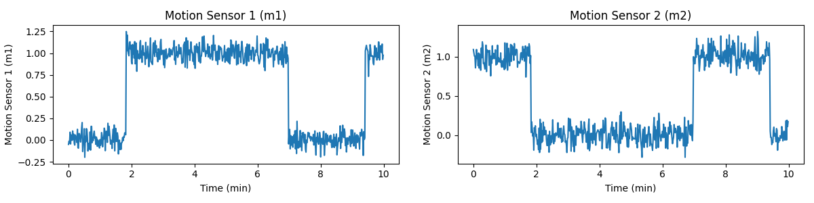
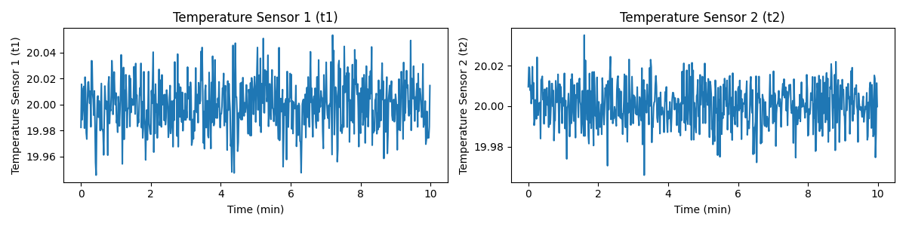
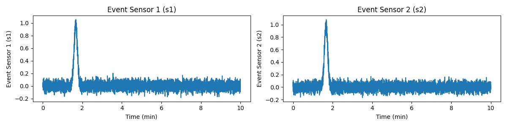
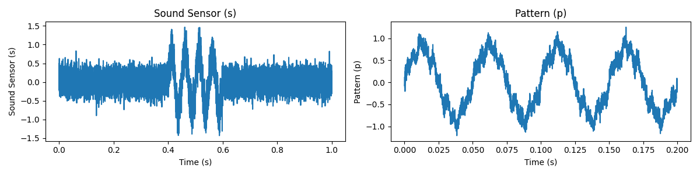

## Task 3-1: Apply ACF (20 points)

**You are required to implement the functions in `task_3_1.py`**.

Compute the frequency spectrum of the following signals. You are supposed to implement `apply_acf_pt()` and `apply_acf_pulse()` for the following two signals, respectively.

The sampling rate `self.fs` is 500 Hz.  In this task, you are required to return the normalized ACF. 

1. Pure Tone: The time range is $0 \le t < 10s$.

$$
s(t) = 2.5 \cdot \cos(2 \pi \cdot 12.3 \cdot t + \pi/3)
$$

2. Pulse signal: The time range is $0 \le t < 2s$.

$$
s(t)= 
\begin{cases}
0 & \text { for } \: 0 \le t < 0.3 \\ 
3 & \text { for } \: 0.3 \le t < 0.9 \\ 
0 & \text { for } \: 0.9 \le t < 1.2 \\ 
2 & \text { for } \: 1.2 \leq t < 1.8 \\ 
0 & \text { for } \: 1.8 \le t < 2
\end{cases},
$$

## Task 3-2: Extract Periodicity from ACF (40 points)

**You are required to implement the functions in `task_3_2.py`**.

In this task, you are now given multiple files. These files contain signals that we want you to perform frequency analysis on. Your task is to implement `get_br_1()`, `get_br_2()`, `get_hr_1()` and `get_hr_2()`, respectively.

1. In the following problems, you should use `task_3_2_1.pickle`. It is a clip of breathing signal. It records the chest movement over time. The sampling rate is 20 Hz.  Normally, the breathing rate of an adult is 12-25 BPM. You are required to calculate the breathing rate following the instructions:

   1) `get_br_1()`: Calculate the breathing rate without windows. You should return the breathing rate (a single float value) in BPM.

   2) `get_br_2()`: Get the breathing rate over time $b(t)$. You should choose the window length as short as possible with time resolution of 1s. Your window length should be chosen from [1, 10]s and we assume the window length here is an integer.
  
2. In the following problems, you should use `task_3_2_2.pickle`. It is a clip of ECG signal after filtering (You do not need to care about it yet.). Your task is to uncover the heart rate from ECG as a function of time. Heartbeat is a periodic event, and the heart rate is the frequency that the heart beats.  The heart rate of this participant is between 60 - 120 BPM (Beat Per Minute).
   
   1) `get_hr_1()`: You should use a 5-s sliding window with step of 2s. 

   2) `get_hr_2()`: You should adjust your window_length and window_step to make sure the frequency resolution is 0.5 Hz and time resolution is 0.1s.
  
**Note:**

- You should use ACF to acquire the results, rather than other approaches. Meanwhile, the accurate answer (Ground Truth, GT) is determined by ACF.
- For task 3_2_1_1, 3_2_2_1 and 3_2_2_2, the answer is fixed. Your answer will be evaluated directly with GT.
- For task 3_2_1_2, you should pick the minimum window length (int) required. You will be graded by the accuracy of your choice of window_length, window_step and your $b(t)$. So will task 3_2_2_1 and 3_2_2_2.

## Task 3-3: Data Similarity (40 points)

**You are required to implement the functions in `task_3_3.py`**.

Imagine you are the junior technical engineer of a startup company SenseAI, which provides solutions to smart homes with monitoring of temperature, motion, event and sound. One of your customers, Ethan, has installed multiple sensors of your brand in his house. He has been noticing odd patterns—like lights turning on when no one’s home or his heating acting up—and he’s asked SenseAI to analyze the sensor data to figure out what’s going on.

Your boss, Dr. C.S. Wu , assigns you to tackle this problem, using what you have learnt in this lab. You will be given the dataset from Ethan's apartment. The dataset contains the following signals: motion sensor data, temperature sensor data, event sensor data, and sound sensor data. Before you start, let's wrap up the concepts you have learnt in this lab.

In class, you’ve used correlation (specifically autocorrelation, ACF) to find repeating patterns in a single signal—like how often a signal oscillates—to calculate frequencies (e.g., breathing or heart rates in Task 3-2). Mathematically, ACF is defined as:

$$
\text{ACF}(\tau) = \sum_{i=0}^{N-1-\tau} s[i] \cdot s[i+\tau],
$$

where $\tau$ is the time shift, $N$ is the length of the signal, and $s(t)$ is the signal at time $t$. With `correlate(s, s, mode='full')`, you get the lags from $-N+1$ to $N-1$, and `acf[acf.size//2:]` gives you the positive lags ($\tau > 0$).

Now, we’ll use correlation to compare two different signals at the same time (or with shifts) to measure their similarity. Here, we introduce Pearson Correlation Coefficient (PCC) to compare different sensor signals and uncover relationships between them. Pearson measures how linearly two signals move together—perfect for solving Ethan’s mysteries. Here’s the formula:

$$
\rho = \frac{\sum_{i=0}^{N-1} (s_1[i] - \bar{s_1})\cdot(s_2[i] - \bar{s_2})}{\sqrt{\sum_{i=0}^{N-1} (s_1[i] - \bar{s_1})^2 \cdot \sum_{i=0}^{N-1} (s_2[i] - \bar{s_2})^2}},
$$

where $s_1$ and $s_2$ are two signals, and $\bar{s_1}$ and $\bar{s_2}$ are their means. You will find the formula is similar to the correlation formula you have seen above. When $\tau=0$, you will get 

$$
\text{ACF}(0) = \sum_{i=0}^{N-1} s[i] \cdot s[i].
$$

This can be seen in the PCC formula above. Specifically, for the numerator, after removing the mean, it is the same as the correlation of two signals (i.e. `correlate(s1, s2, mode='full')`) and extracting the value at lag 0. For the denominator, it is the square root of the product of the ACF of each signal at lag 0.

> **Checkpoint 1 (10 points):** Implement `get_pcc(s1, s2)` to calculate the Pearson Correlation Coefficient between two signals. You should return a single float value.

You should use `correlate` to calculate the PCC. We will delete any `scipy.stats.pearsonr` or `np.corrcoef` in your code.

The PCC is a very powerful indicator of similarity between two signals. It ranges from -1 to 1, where 1 means the signals are perfectly correlated, -1 means they are perfectly anti-correlated, and 0 means they are uncorrelated. 

**You are required to use the PCC / Correlation to solve the following problems.**

> Note: The sensors are not necessarily working improperly. You should trust your analysis.

You will first work on the motion sensor data. There are two sensors inside the apartment, one in the living room and one in the bedroom. Typically, the light will be turned on when the motion sensor detects movement. When someone is in the living room, we assume that the light in the living room is on. When someone is in the bedroom, we assume that the light in the bedroom is on. We assume that when the person is in the living room, only the motion sensor in the living room will be triggered. The same applies to the bedroom. In other words, the data from the two sensors should be negatively correlated.

Below is an example of the motion sensor data. The sampling rate is 1 Hz.

> **Checkpoint 2 (5 points):** Implement `check_motion_sensors(m1, m2)` to calculate the PCC between the two motion sensor signals. You should return the PCC value and a Boolean value indicating whether the two sensors are working properly.

You will then work on the temperature sensor data. There are two temperature sensors in the apartment, one in the living room and one in the bedroom. The temperature in the living room and the bedroom should be positively correlated.

Below is an example of the temperature sensor data. The sampling rate is 1 Hz.

> **Checkpoint 3 (5 points):** Implement `check_temperature_sensors(t1, t2)` to calculate the PCC between the two temperature sensor signals. You should return the PCC value and a Boolean value indicating whether the two sensors are working properly.

On Friday at 11:00 p.m., while he’s at a late study session, his smart home app pings him with an alert: two event sensors—one in the living room near his desk and one by the front door—picked up a sharp crack, like glass breaking. The living room sensor logs it at 11:00:10 p.m., but the door sensor records it at 11:00:10.2 p.m., a 0.2-second mismatch. Ethan’s security system, synced to these sensors, uses sound timing to trigger a break-in alarm and notify the police—but the 0.2-second drift, caused by a recent network lag, risks misclassifying it as two separate noises (e.g., a knock and a crack), delaying the alert. Ethan needs you to sync the signals to confirm it’s one event—a potential break-in—so he can override the system’s confusion, trigger the alarm, and check his door cam footage before someone gets away with his laptop. The threshold for synchronization is 0.1 seconds.

To this end, you will check the two event sensors in the apartment and examine the synchronization between them.

Below is an example of the event sensor data. The sampling rate is 0.1 Hz.

> **Checkpoint 4 (10 points):** Implement `sync_event_signals(s1, s2)` to synchronize the two sound sensor signals. You should return the delay in seconds and whether it can normally trigger the alarm.

Finally, Ethan’s been puzzled by flickering lights even when he’s away. He suspects a neighbor’s loud music might be triggering the sound-activated lighting system falsely. On Saturday morning, the living room sound sensor records ambient noise, and Ethan provides a known pattern of his neighbor’s bass-heavy music (pattern, 100 samples). You are required to detect the pattern in the sound sensor signal.

Below is an example of the sound sensor data. The sampling rate is 16 kHz.

> **Checkpoint 5 (10 points):** Implement `detect_music_pattern(s, p)` to detect the neighbor’s music pattern in the sound signal. Use PCC to find where the pattern best matches. Return the starting index (integer) of the strongest match.

You will then report your results to the company's internal system -- Moodle, where your boss and Ethan will see them. Thanks for your efforts!

## How to submit

**Please run `python check.py --uid <YOUR_UID>` before submitting.** This script performs automated tests on the examples provided in the docstrings. Failing these tests indicates potential critical issues in your code. Strive to resolve these problems. After that, it will create a zip file named after your `uid`. Make sure you enter the right `uid`. 

It's important to avoid changing the names of any files, including both the zip file and the program files contained within. Altering file names can lead to grading errors. Ensure that all file names remain as they are to facilitate accurate assessment of your work.

Your submission to **Moodle** should consist solely of the **generated `*.zip` file**. It is your responsibility to double check whether your submitted zip file includes your latest work. 

